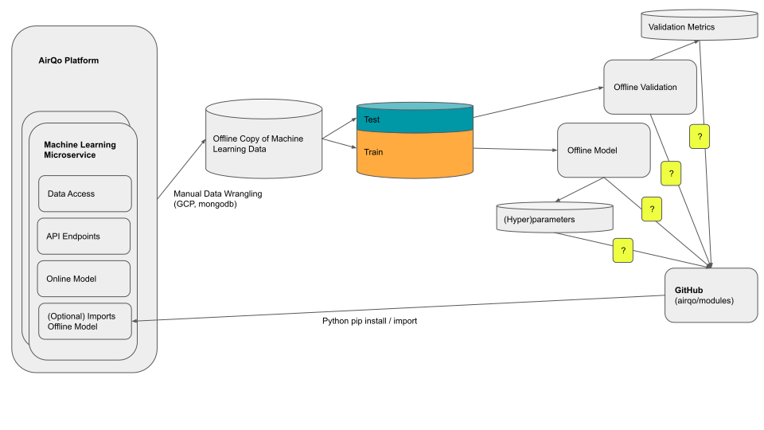

# AirQo-modules

## Summary

## Contributing

## Installation

## Tests

## Usage

## Documentation

Documentation for implemented modules can be found here:

https://airqo-modules.readthedocs.io/

## Continuous Integration

## Static Analysis

## License